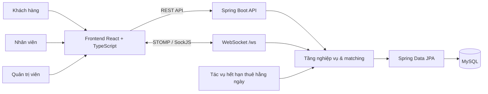

# Hệ thống CRM quản lý Bất động sản Estate Advance

Một nền tảng vận hành bất động sản full-stack, hỗ trợ quản lý bất động sản, nhu cầu khách hàng, nhân viên kinh doanh và quy trình từ tư vấn đến giao dịch. Hệ thống giúp khách hàng tìm bất động sản phù hợp, đồng thời cung cấp công cụ điều phối, theo dõi hiệu suất và chốt giao dịch cho nhân viên và quản trị viên.

## Giới thiệu dự án

### Bài toán

Đội ngũ tư vấn bất động sản cần một nơi tập trung để quản lý nguồn hàng, ghi nhận nhu cầu khách hàng, phân bổ công việc hợp lý và theo dõi tiến độ bán hàng. Việc phân công thủ công dễ bỏ sót tải công việc, khu vực phụ trách và hiệu suất của nhân viên; từ đó làm chậm quá trình ghép nối và gây khó khăn cho báo cáo vận hành.

### Giải pháp

Estate Advance tập trung các quy trình này cho ba nhóm người dùng:

- **Khách hàng:** đăng ký/đăng nhập, gửi nhu cầu bất động sản, nhận gợi ý bất động sản phù hợp và trò chuyện với bộ phận hỗ trợ.
- **Nhân viên kinh doanh:** xem bất động sản và yêu cầu khách hàng được phân công, theo dõi tư vấn, cập nhật tiến độ giao dịch và trao đổi trong phòng chat.
- **Quản trị viên:** quản lý người dùng và bất động sản, phân công nhân viên, xem gợi ý, theo dõi chỉ số dashboard và điều phối vận hành.

Dự án dùng cơ chế chấm điểm theo quy tắc nghiệp vụ để gợi ý bất động sản cho khách hàng, hoặc gợi ý nhân viên phù hợp cho khách hàng và bất động sản. Khi giao dịch hoàn tất, hệ thống đồng thời cập nhật hoa hồng, doanh thu nhân viên, số lượng giao dịch và trạng thái bất động sản.

## Tính Năng Chính

- **Quản lý bất động sản:** tạo, tìm kiếm, xem, cập nhật, xóa và phân công bất động sản; quản lý diện tích cho thuê và trạng thái sẵn có.
- **Quản lý nhu cầu khách hàng:** khách hàng gửi yêu cầu mua/thuê; quản trị viên phân công yêu cầu cho nhân viên phù hợp.
- **Ghép nối thông minh:**
  + Gợi ý bất động sản đang sẵn có từ các tiêu chí nhu cầu: vị trí, ngân sách, diện tích và loại bất động sản.
  + Gợi ý nhân viên cho khách hàng dựa trên khu vực phụ trách, hiệu suất, tải công việc hiện tại và điểm cộng nhân viên mới.
  + Gợi ý nhân viên phụ trách bất động sản dựa trên độ khó của bất động sản, vị trí, hiệu suất và tải công việc.
- **Vòng đời tư vấn và giao dịch:** kiểm tra tính hợp lệ của luồng trạng thái `NEW → ASSIGNED → CONSULTING → SIGNED → PAID`.
- **Tự động hóa hoa hồng và doanh thu:** khi thanh toán, hệ thống tính hoa hồng bán/cho thuê, cập nhật doanh thu và thống kê giao dịch của nhân viên, đồng thời đổi trạng thái bất động sản thành `SOLD` hoặc `RENTED`.
- **Tác vụ hết hạn thuê:** tự động chuyển các bất động sản đã hết hạn thuê về trạng thái `AVAILABLE` mỗi ngày.
- **Trao đổi thời gian thực:** chat WebSocket với STOMP/SockJS, phòng chat, quản lý thành viên, lịch sử tin nhắn và chia sẻ bất động sản qua chat.
## Công Nghệ Sử Dụng

| Frontend | React 19, TypeScript, Vite, Ant Design, React Router, Axios. 
| Backend | Java 8, Spring Boot 2.7.18, Spring MVC, Spring Data JPA, Spring Security, Maven. 
| Cơ sở dữ liệu | MySQL 8, Hibernate/JPA.
| Thời gian thực | Spring WebSocket, STOMP, SockJS.
| Công cụ hỗ trợ | ModelMapper, JSP/JSTL cho giao diện legacy, Cloudinary ở frontend, ESLint.

## Kiến trúc & sơ đồ cơ sở dữ liệu

### Kiến trúc ứng dụng



### Mô hình dữ liệu / ERD

```text
docs/images/estate-advance-erd.png
```

Các thực thể chính: `User`, `Role`, `Building`, `RentArea`, `Customer`, `Demand`, `CustomerRequest`, `AssignmentBuilding`, `AssignmentCustomer`, `ChatRoom`, `ChatRoomMember`, `ChatMessage`, `Province` và `Ward`.


## Bắt Đầu

### Yêu Cầu Hệ Thống

- JDK 8+
- Maven 3.6+
- MySQL 8+
- Node.js 20+ và npm (chỉ cần khi chạy frontend đi kèm)

### Cài Đặt

1. Clone repository hoặc di chuyển đến thư mục dự án
2. Tạo cơ sở dữ liệu

```sql
CREATE DATABASE estateadvance
  CHARACTER SET utf8mb4
  COLLATE utf8mb4_unicode_ci;
```

3. Cấu hình môi trường

Không commit thông tin đăng nhập cơ sở dữ liệu. Spring Boot nhận các biến môi trường sau; chúng sẽ ghi đè giá trị local trong `src/main/resources/application.properties`.

```env
# .env.example — dùng làm mẫu, nạp biến qua shell hoặc IDE
SPRING_DATASOURCE_URL=jdbc:mysql://localhost:3306/estateadvance?useUnicode=true&characterEncoding=utf8&serverTimezone=Asia/Ho_Chi_Minh
SPRING_DATASOURCE_USERNAME=your_mysql_user
SPRING_DATASOURCE_PASSWORD=your_mysql_password
SPRING_JPA_HIBERNATE_DDL_AUTO=update

# Thiết lập Spring Boot tùy chọn
SERVER_PORT=8080
```

Ví dụ trên PowerShell:

```powershell
$env:SPRING_DATASOURCE_URL = 'jdbc:mysql://localhost:3306/estateadvance'
$env:SPRING_DATASOURCE_USERNAME = 'your_mysql_user'
$env:SPRING_DATASOURCE_PASSWORD = 'your_mysql_password'
```

4. Build và chạy backend

```bash
mvn clean install
mvn spring-boot:run
```

Backend mặc định chạy tại `http://localhost:8080`. WebSocket endpoint: `http://localhost:8080/ws`.

5. Chạy frontend (khi có mã nguồn frontend)

```bash
cd frontend
npm install
npm run dev
```

Tạo `frontend/.env.local` nếu cần:

```env
VITE_API_BASE_URL=http://localhost:8080
```

Địa chỉ Vite mặc định: `http://localhost:5173`.

## Cấu Trúc Dự Án

Backend
```
src/
│   └── main/
│       ├── java/com/javaweb/
│       │   ├── api/            # REST API và WebSocket controller
│       │   ├── builder/        # Builder cho yêu cầu tìm kiếm
│       │   ├── config/         # Security, CORS, JPA, WebSocket, cấu hình hoa hồng
│       │   ├── entity/         # JPA entity
│       │   ├── enums/          # Trạng thái và hằng số nghiệp vụ
│       │   ├── model/          # DTO, request và response
│       │   ├── repository/     # JPA repository và custom query
│       │   ├── scheduler/      # Tác vụ chạy nền theo lịch
│       │   ├── security/       # Tiện ích và handler xác thực
│       │   ├── service/        # Interface và xử lý nghiệp vụ
│       │   └── utils/          # Chấm điểm, mapping và tiện ích chung
│       └── resources/
│           ├── data/           # Dữ liệu địa giới hành chính
│           ├── static/         # Static asset legacy
│           ├── application.properties
│           └── data.sql
```
Frontend
```
**├── src/
│   │   ├── api/          # Axios client và API modules
│   │   ├── components/   # Thành phần UI theo vai trò
│   │   ├── hooks/        # Custom hooks, gồm chat realtime
│   │   ├── layouts/      # AdminLayout, StaffLayout
│   │   ├── pages/        # customer, staff, admin
│   │   ├── types/        # TypeScript DTOs và response types
│   │   └── utils/        # Formatters, mapping và helpers
│   └── package.json**
```

## Tổng quan API

Base URL: `http://localhost:8080`

| Nhóm | Phương thức | Endpoint | Mục đích |
| --- | --- | --- | --- |
| Xác thực khách hàng | `POST` | `/api/customer/auth/register` | Đăng ký tài khoản khách hàng và nhu cầu tùy chọn |
| Xác thực khách hàng | `POST` | `/api/customer/auth/login` | Đăng nhập khách hàng |
| Xác thực nhân viên | `POST` | `/api/staff/auth/register` | Đăng ký tài khoản nhân viên |
| Xác thực nhân viên | `POST` | `/api/staff/auth/login` | Đăng nhập nhân viên |
| Người dùng | `GET`, `POST`, `PUT`, `DELETE` | `/api/user/**` | Quản lý nhân viên/người dùng, hồ sơ, mật khẩu |
| Bất động sản | `GET`, `POST`, `DELETE` | `/api/building/**` | Quản lý bất động sản và phân công nhân viên |
| Yêu cầu khách hàng | `GET`, `POST` | `/api/customer/**`, `/api/customer-request/**` | Tạo, xem và phân công nhu cầu khách hàng |
| Matching bất động sản | `POST` | `/api/customer-matching/find-buildings` | Tìm bất động sản phù hợp cho khách hàng |
| Matching khách hàng–nhân viên | `POST` | `/api/staff-customer-matching/find-staff` | Gợi ý nhân viên cho khách hàng |
| Matching bất động sản–nhân viên | `POST` | `/api/building-staff-matching/find-staff` | Gợi ý nhân viên cho bất động sản |
| Trạng thái giao dịch | `PUT` | `/api/customer-status/update` | Cập nhật vòng đời tư vấn/giao dịch và xử lý thanh toán |
| Thống kê | `GET` | `/api/statistics/dashboard` | Tổng quan dashboard và hiệu suất nhân viên |
| Hành chính | `GET` | `/api/administrative/provinces/**` | Tra cứu tỉnh/thành và phường/xã |
| Phòng chat | `GET`, `POST`, `PATCH`, `DELETE` | `/api/chat/rooms/**` | Quản lý phòng chat, thành viên, tin nhắn và trạng thái đã đọc |
| Chat thời gian thực | `STOMP` | `/app/chat.send` | Gửi tin nhắn; subscribe `/topic/rooms.{roomId}` |


